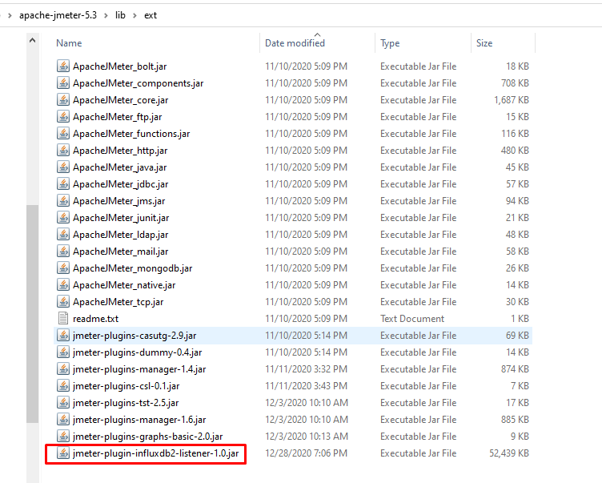
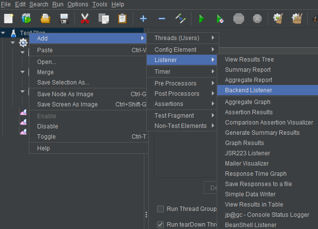
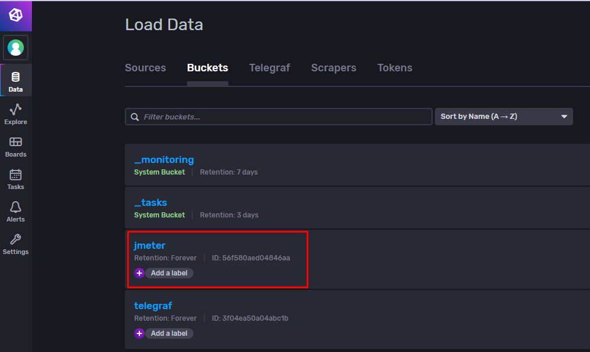
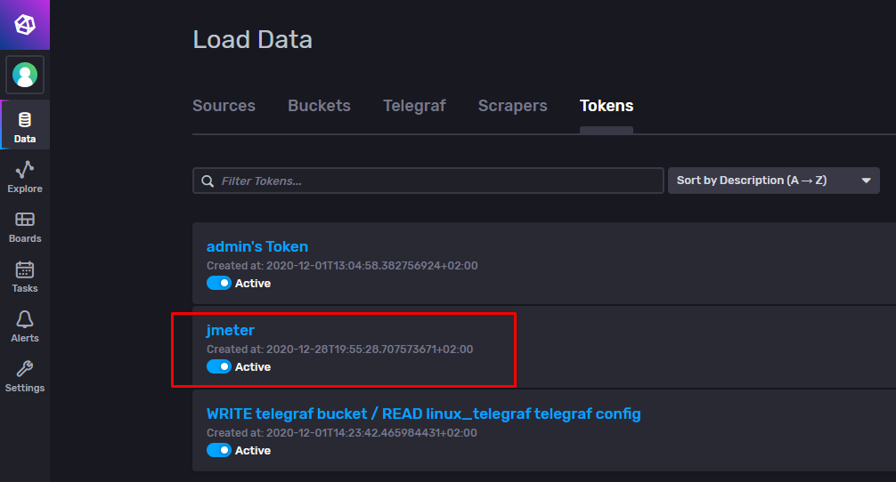
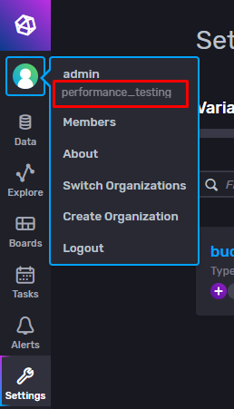
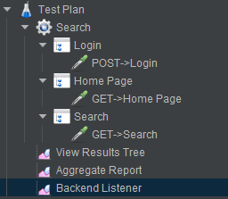
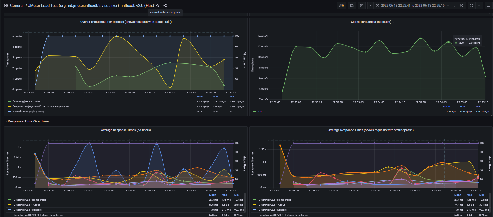

# JMeter InfluxDB v2.0 listener plugin

## Description
The goal of the project is to make a quite similar online dashboard in the same way as JMeter generates. Supported the latest InfluxDB v2.0 and created appropriate dashboard ("Flux" language has been used to create the queries - now there are a lot fo capacities to build amazing charts, tables with a lot of math function).
So that it would be possible to build the monitor hardware solution on the latest InfluxDB v2.0 and telegraf (agent to send the hardware metrics to InfluxDB) as well.

The plugin sends metrics to InfluxDB and provides the possibility to visualize the charts in Grafana, have the Aggregate report as JMeter creates. Added the possibly to save the following extra fields in the database:
* Response code;
* Error message;
* Response body of the failed requests (can be configured);
* Connect time;
* Latency;
* The response time (uses from the SampleResult.class, needs to make aggregate report).

## Compatibility
The supported versions:
* Java 11 - make sure that you have it.
* InfluxDB v2.0, see release notes: https://docs.influxdata.com/influxdb/v2.0/reference/release-notes/influxdb/  (1.8 is not supported)
* JMeter 5.3 or higher.

## Deployment
* Put '`jmeter-plugin-influxdb2-listener-<version>.jar`' file from [Releases](https://github.com/mderevyankoaqa/jmeter-influxdb2-listener-plugin/releases) to `~<JmeterPath<\lib\ext`; 

Note: "fatJar" gradle task should be used to create the package for the JMeter.

 

* Run JMeter and select the test plan, Add-> Listener -> Backend Listener.
 

* Select from the dropdown item with the name '`org.md.jmeter.influxdb2.visualizer.JMeterInfluxDBBackendListenerClient`'.

 

## InfluxDB configuration
* Create Bucket to store the further testing results.

 
  
* Create the token with read and write rights.

 

## Plugin configuration
Let’s explain the plugin fields:
* `testName` - the name of the test.
* `nodeName` - the name of the server.
* `runId` - the identification number of hte test run, can be dynamic.
* `influxDBScheme` - InfluxDB server scheme (can be http or https) .
* `influxDBHost` - the host name or ip of the InfluxDB server.
* `influxDBPort` - the port of the InfluxDB server, the default is 8086.
* `influxDBToken` - the influxdb bucket token, the default value should be updated, copy it from InfluxDB site.

 
  
* `influxDBOrganization` - the influxdb bucket organization, the default value should be updated, copy it from InfluxDB site.

 
  
* `influxDBBucket` - the InfluxDB bucket name to store the test results.
* `samplersList` - the regex value to sort out the JMeter samplers results; the default is _`.*`_. For example if you have the pattern of JMeter test plan development like this - create the 'Transaction controller', add inside of the 'Transaction controller' the Sampler with request, and the name pattern '`GET->Something`', like on the see screen below.
 
 

The regex `^(Home Page|Login|Search)(-success|-failure)?$` can be used to save only samplers names. The regex can be generated from JMeter menu.

 

You can modify the generated string in terms of your purposes.

 

* `useRegexForSamplerList` - allows to use the regexps if set to 'true'.
* `recordSubSamples` - allows to save the JMeter sub samples if set to 'true'.
* `saveResponseBodyOfFailures` - allows to save the response body of the failures.

## Grafana dashboard capabilities
See deployment instructions here https://grafana.com/grafana/dashboards/13644

Dashboard helps:
* Monitor throughput with active users.

 
  
* Overview and analise the response time, distribution as well.

 
  
* See aggregate report. 
  The table rendering may take an extra time. The table has hardware resources consuming queries from Influxdb side. If you have low hardware on the Influxdb server - recommended make the clone of the original dashboard and remove aggregate report.
  So the idea - it's to have one 'fast' dashboard for the online monitoring (has no aggregate report) to see the results while the test, the second (original with aggregate report) to see the final results.
  
 
 
* Investigate errors. The table is interactive, it's possible to filter data in the columns and see details for the specific error.

 
  
* See network statistics, latency, processing time.

 
  
* Check individual request details.

 

